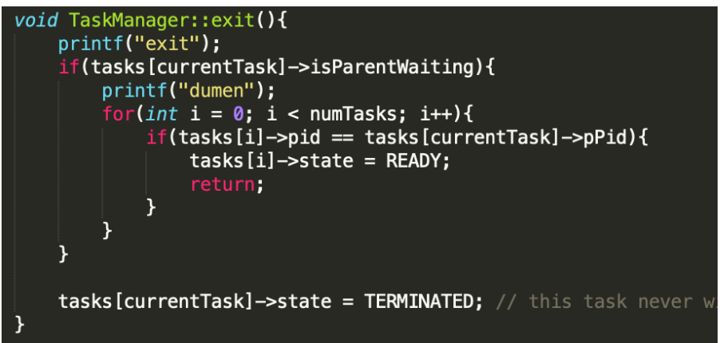

# My Operating System

This project is done for CSE312 course in Gebze Technical University. The goal was to implement system calls in Viktor Engellmans(https://www.youtube.com/watch?v=1rnA6wpF0o4&list=PLHh55M_Kq4OApWScZyPl5HhgsTJS9MZ6M) operating system and running programs on this OS.

Firstly, I began the homework with trying to understand the operating system by watching all the videos. I watched all the videos to the 7th video. After that, I just skipped the graphics part because it is unnecasary to watch for us. Our goal is to implement system calls and run some programs on it. So after watching 7th video, I watched 15th video and it is very explaining. Before watching 15th video, I didn’t know anything about what we can do and how we can do. After that, I watched 16th video(Dynamic Memory Management). And after that, I watched the 20th video which is very explaining about system calls implementation. After that, I started to write system calls.

## Systemcall Handler
For the system calls, I use the snippet Viktor Engellman created for printf system call. The SystemcallHandler’s HandleInterrupt method handles the system calls with help of interrupts. When the interrupt comes with 0x80 interrupt index, the SystemcallHandler automatically handles the interrupt with it’s HandleInterrupt method. All the system calls are compatible with POSIX standarts.


## Fork

The fork system call is implemented like in the figure. Let’s ignore the debugging protocols with print functions. It firstly sets up the pointers for child and parent process. After that, it copies the instruction pointer and code segment of parent process to child process. The stack duplication is handled afterwards. Since the cpustate values have to be same with parent process, it is copied. The base of the CPU state for the child is recalculated to ensure it points correctly within the newly copied stack. This involves calculating the offset from the base of the parent’s CPU state and adjusting the child’s CPU state pointer accordingly. After that, the child’s ecx value is set to 0 to distinguish parent and child process. When the child process’ pid returned to SystemcallHandler, it puts returned value to parent’s ecx value. Finally, the childTask is added.


## Execve

The execve system call is more easy to understand, it basically changes the child process’ instruction pointer to newly given entrypoint and just returns the current tasks cpustate. It returns esp to interrrupt handler in SystemcallHandler. When I didn’t do it it just continues without doing execve.


## Waitpid

The waitpid system call is very basic. It just sets the child pid’s isParentWaiting variable to true and sets parent processes status to BLOCKED. In the schedule system calls shown, it is guaranteed that the BLOCKED process is not scheduled.


## Exit

The exit system call is as simple as waitpid. It just controls there are any parent process waiting for this process it just awake the parent process up by setting it’s state to READY. After that, it just sets it’s status to TERMINATED. In the schedule system calls shown, it is guaranteed that the TERMINATED process is not scheduled.



## Scheduler

The schedule function is implemented like this. If processes are TERMINATED or BLOCKED, the process is not scheduled. It works with standart round robin style.


To run OS, you'll have to few packages to run this Operating System.
-xorriso
-grub2
-VirtualBox
-melf-i386 tools etc.

```sh
make run # Directly runs the OS.
make clean # Cleaning
